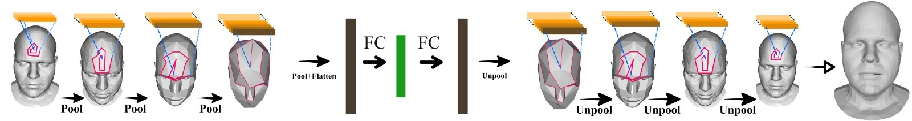

# Project Abstract 
*Generative models for 3D geometric data arise in many important applications in 3D computer vision and graphics. In this paper, we focus on 3D deformable shapes that share a common topological structure, such as human faces and bodies. Morphable Models and their variants, despite their linear formulation, have been widely used for shape representation, while most of the recently proposed nonlinear approaches resort to intermediate representations, such as 3D voxel grids or 2D views. In this work, we introduce a novel graph convolutional operator, acting directly on the 3D mesh, that explicitly models the inductive bias
of the fixed underlying graph. This is achieved by enforcing consistent local orderings of the vertices of the graph,
through the spiral operator, thus breaking the permutation invariance property that is adopted by all the prior work
on Graph Neural Networks. Our operator comes by construction with desirable properties (anisotropic, topologyaware, lightweight, easy-to-optimise), and by using it as a building block for traditional deep generative architectures, we demonstrate state-of-the-art results on a variety of 3D shape datasets compared to the linear Morphable Model and other graph convolutional operators.* 

[Arxiv link](https://arxiv.org/abs/1905.02876)


# Repository Requirements

This code was written in Pytorch 1.1. We use tensorboardX for the visualisation of the training metrics. We recommend setting up a virtual environment using [Miniconda](https://docs.conda.io/en/latest/miniconda.html). To install Pytorch in a conda environment, simply run 

```
$ conda install pytorch torchvision -c pytorch
```

Then the rest of the requirements can be installed with 

```
$ pip install -r requirments.txt
```

and specifically with Python2 (we need Python 2 not for training but for the downsampling and upsampling, see below)

### Mesh Decimation
For the mesh decimation code we use a function from the [COMA repository](https://github.com/anuragranj/coma) (the files **mesh_sampling.py** and **shape_data.py** - previously **facemesh.py** - were taken from the COMA repo and adapted to our needs). In order to decimate your template mesh, you will need the [MPI-Mesh](https://github.com/MPI-IS/mesh) package (a mesh library similar to Trimesh or Open3D).  This package requires Python 2. However once you have cached the generated downsampling and upsampling matrices, it is possible to run the rest of the code with Python 3 as well, if necessary. In order to install MPI-Mesh do the following (or read their installation instructions if something is unclear):

```
$ git clone https://github.com/MPI-IS/mesh.git
$ cd mesh
$ apt-get install libboost-all-dev
$ make
$ make install
```


# Data Organization

The following is the organization of the dataset directories expected by the code:

* data **root_dir**/
  * **dataset** name/ (eg DFAUST)
    * template
      * template.obj (all of the spiraling and downsampling code is run on the template only once)
      * downsample_method/ (in case you use a different mesh decimation algorithm)
        * template_d0.obj (same as template.obj)
        * template_d1.obj
        * template_d2.obj
            ...           (depending on the levels of hierarchy you use)
    * preprocessed/
      * train.npy (number_meshes, number_vertices, 3) (no Faces because they all share topology)
      * test.npy 
      * points_train/ (created by data_generation.py)
      * points_val/ (created by data_generation.py)
      * points_test/ (created by data_generation.py)
      * paths_train.npy (created by data_generation.py)
      * paths_val.npy (created by data_generation.py)
      * paths_test.npy (created by data_generation.py)

# Usage

#### Data preprocessing 

```
$ python data_generation.py --root_dir=/path/to/data_root_dir --dataset=DFAUST --num_valid=100
```

#### Training and Testing

For training and testing of the mesh autoencoder, we provide an ipython notebook, which you can run with 

```
$ jupyter notebook neural3dmm.ipynb
```

The first time you run the code, it will check if the downsampling matrices are cached (calculating the downsampling and upsampling matrices takes a few minutes), and then the spirals will be calculated on the template (**spiral_utils.py** file).

In the 2nd cell of the notebook one can specify their directories, hyperparameters (sizes of the filters, optimizer) etc. All this information is stored in a dictionary named _args_ that is used throughout the rest of the code. In order to run the notebook in train or test mode, simply set:

```
args['mode'] = 'train' or 'test'
```

#### Some important notes:
* The code has compatibility with both _mpi-mesh_ and _trimesh_ packages (it can be chosen by setting the _meshpackage_ variable in the first cell of the notebook).
* The reference points parameter needs exactly one vertex index per disconnected component of the mesh. So for DFAUST you only need one, but for COMA which has the eyes as diconnected components, you need a reference point on the head as well as one on each eye.
* The **spiral_utils.py** In order to get the spiral ordering for each neighborhood, the spiraling code works by walking along the triangulation exploiting the fact that the triangles are all listed in a consistent way (either clockwise or counter-clockwise). These are saved as lists (their length depends on the number of hops and number of neighbors), which are then truncated or padded with -1 (index to a dummy vertex) to match all the spiral lengths to a predefined value L(in our case L = mean spiral length + 2 standard deviations of the spiral lengths. These are used by the SpiralConv function in **models.py**, which is the main module of our proposed method.


